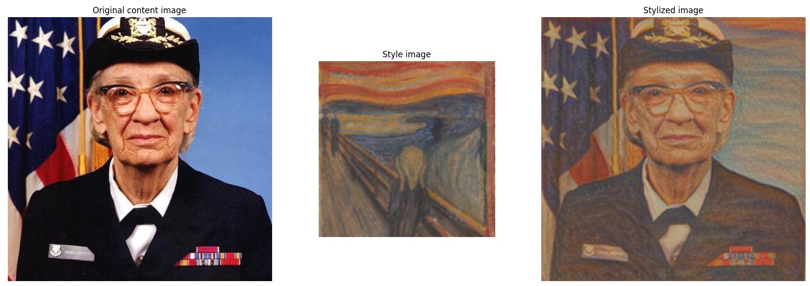

# Artistic Style Transfer Web Application

In this project, I built a web application that uses the pre-trained deep learning model in [TensorFlow_Hub] (https://www.tensorflow.org/hub/tutorials/tf2_arbitrary_image_stylization) and outputs artistic stylizations on images of choice.

# Before You Begin

### Set Up Environment

1.  Clone this repo to your machine
2.  Open Conda Prompt:
    - Either create a new environment using requirements.txt:
      `conda create --name <env> python=3.7 --file requirements.txt`  
    - Or create a new environment using PythonML.yml:
      `conda env create -f PythonML.yml`
3.  Once everything is installed, use your editor of choice and activate your environment with either:
    `conda activate <env>` or `source activate <env>`

## References

The following references should be looked at for further reading on Image Stylization using Neural Networks.

* Original manuscript - Exploring the structure of a real-time, arbitrary neural artistic stylization network [here](https://arxiv.org/abs/1705.06830).

* TensorFlow Hub Notebook [here](https://www.tensorflow.org/hub/tutorials/tf2_arbitrary_image_stylization).

* Magenta Project [here](https://github.com/magenta/magenta/tree/master/magenta/models/arbitrary_image_stylization).

